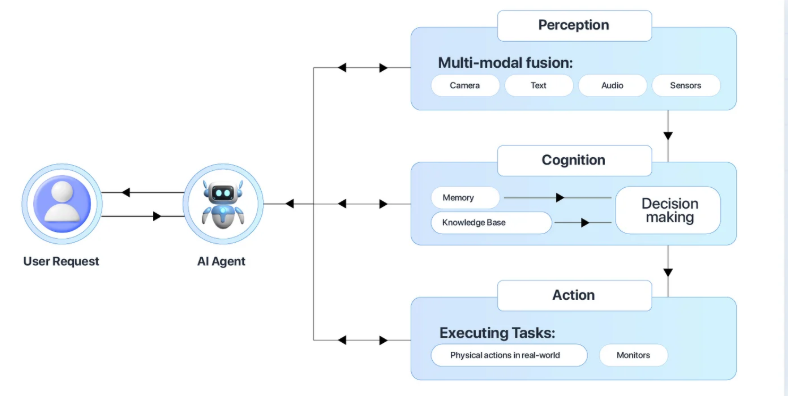

# About this ShowCase project demonstrating Agentic AI
Agentic AI is the frontier and 3rd wave of AI (1. Predictive, 2. Generative). AI Agents are different from its predecessors in the sense that they are able act autonomously without human supervision and interference.
Agentic AI is generally used in the field of automating repetitive tasks, like data entry, data analysis, inventory management, order management and customer support...
## What is the reason of having AI Agents implemented on your systems.
1. freeing up human resources, letting these resources focus on strategic and create tasks like innovation. This will at the end improve the overall organizational performance.
2. Agents are not getting tired, do not need weekends and holidays and can work around the clock 24/7.

## How do you do that.
The heart of AI is the LLM, this is the brain and memory of AI, LLM's can reason based on the knowledge it was provided, that memory and knowledge is limited to the data it was trained for, aka knowledge cut-off. 
Turning an LLM into an AI Agent what you see demonstrated from this ShowCase project means providing the capabilities to read real-time and domain-specific data and autonomously act after reasoning based on that data it was provided; like sending notifications, change the state of your business systems like inserting order records on your OMS database.<br><br>
Software integrators like me use frameworks like Spring AI to providing these capabilities and giving it the tools to collect additional data and act. That is what I try to demonstrate here through a simple Use Case which I worked out on this GitHub repository.
## Agentic AI ShowCase with Spring AI and Azure AI Foundry
This project demonstrates how to implement an AI Agent with [Java Spring AI](https://docs.spring.io/spring-ai/reference/index.html) framework and how use [Terraform](https://developer.hashicorp.com/terraform) Infrastructure-as-Code (IaC) tool to configure Azure AI Foundry components to hosting LLM models and Azure AKS Kubernetes cluster to run the containerized AI Agent as POD.
## Model Context Protocol (MCP)
This AI Agent implementation is adhering [Model Context Protocol (MCP)](https://docs.spring.io/spring-ai/reference/api/mcp/mcp-overview.html) to letting that Agent communicate with external tools to fetching additional data on top of what it was learned and calling external tools executing tasks once its reasoning was done.

The MCP Client (*the AI Agent from this demo*) is a key component in the Model Context Protocol (MCP) architecture, responsible for establishing and managing connections with MCP servers (*AI MCP servers from this demo*).
The MCP servers from this demo will enable the AI agent to retrieve data from external tools (Portfolio DB stock inventory records and REST API call to fetching financial assets (stocks) from [twelvedata.com](https://twelvedata.com/) ), plan actions like sending notifications over WhatsUp and updating Portfolio DB stock inventory records.


## About Agentic AI
What is Agentic AI? Put simply, AI agents can work in isolation, without human intervention to autonomously take actions to achieve specific goals. AI agents collaborate in real-time to automate complex tasks and enhance decision-making.
Automating repetitive tasks through implementing AI agents allows human resources to focus on more strategic and creative tasks, which can drive to innovation and improve overall organizational performance. Agentic AI also referred as to AI Agents are the next frontier of Artificial Intelligence.

### How Does Agentic AI work?



1. **Preceive** : sensing for additional data on top of what it was learned on from various sources, such as proprietary database, digital interfaces, REST API **(MCP Servers)**.
2. **Reason** : interacting with LLM as the reasoning engine to understand and come to a conclusion. Taking in the prompt it was provided (constrained to the relevant business logic), alternatively using techniques like RAG (retrieval-augmented generation) to enriching with proprietary data sources and deliver accurate relevant outputs.
3. **Act** : executing tasks by calling external tools, like opening new DB orders on an OMS Order Management System. **(MCP Servers)**. 
4. **Learn**: Continuously improving through feedback loops (data flywheel) by feeding back data into its system to enhance its model, ability to adapt and improve it effectiveness over time.

### MCP Client AND Server components
MCP Client and Server components are modelled as separate MicroServices, version managed on individual Git repositories. Each MS component is destined to get containerized and deployed as a POD on Kubernetes namespace on [Azure AKS](https://learn.microsoft.com/en-us/azure/aks/what-is-aks).
That AKS Kubernetes cluster was provisioned through the Terraform scripts that you can find on the [POC-MCP-CLIENT](https://github.com/agilesolutions/poc-mcp-client) project, this project acts as the central AI Agent running on AKS connecting to external tools also running on that same AKS cluster as POD.
- **POC-MCP-CLIENT** : The actual AI Agent calling MCP servers to fetching (*preceive*) additional data and executing external tasks like sending notifications and updating DB records. ([sources github](https://github.com/agilesolutions/poc-mcp-client))
- **STOCK-MCP-SERVER** : MCP server providing tools to fetch financial assets from [twelvedata.com](https://twelvedata.com/). ([sources github](https://github.com/agilesolutions/stock-mcp-server))
- **PORTFOLIO-MCP-SERVER** : MCP server to fetching and updating stock portfolio records from proprietary RDMS database like PostgreSQL. ([sources github](https://github.com/agilesolutions/portfolio-mcp-server)) 
- **NOTIFICATION-MCP-SERVER** : MCP server to sending out notifications over WhatsUp. ([sources github](https://github.com/agilesolutions/notification-mcp-server))

### What kind of software components can you find on this project 
- Terraform configuration files to provisioning all Azure infrastructure components needed to run this demo in its full context. That includes a full Azure Kubernetes AKS cluster and [Azure AI](https://learn.microsoft.com/en-us/azure/ai-foundry/what-is-ai-foundry) Foundry HUB, project and finally deploying gpt-4 LLM model.
- [SpringBoot AI](https://docs.spring.io/spring-ai/reference/index.html) empowered Java SpringBoot application:
  - Connecting to Azure AI Foundry
  - Connecting to Azure Search VectorStore to loading stock prices growth from [TwelveData](https://twelvedata.com/) to supporting AI RAG.
  - Exposing REST API endpoints to invoking AI ChatBot logic underneath.
  - Misc integration tests to accessing Semantic searches and evaluating LLM responses on [Relevancy and Factual Accuracy](https://www.evidentlyai.com/llm-guide/llm-as-a-judge).
- Gradle scripts build to compile, test and package to a deployable archive.
- Docker and HELM chart artifacts to providing Kubernetes manifests and deploy this solution onto Azure AKS.
- CI/CD ADO Azure DevOps Pipeline - Fully automated build package and deployment with Azure DevOps.
- Enterprise-Grade Security - Uses OAuth2 and API Gateway for authentication.
- Scalable & Cloud-Native - Deployable on Azure App Service or Kubernetes.
- Centralized Logging (Azure Monitor, Application Insights)
- Monitoring & Alerts (Azure Monitor, Prometheus/Grafana)
- Security Best Practices (Key Vault for secrets, RBAC, Network Policies)

## Architecture
### Tech Stack
- Spring Framework and SpringBoot (makes it easy to create stand-alone, production-grade Spring based Applications that you can "just run")
- Spring AI (provides abstractions that serve as the foundation for developing AI applications)
- Azure AI foundry (providing a unified platform for enterprise AI operations, model builders, and application development)
- Terraform (managing infrastructure using a declarative configuration language, making it easier to automate Azure Cloud infrastructure provisioning, all resources needed to run this application including AKS Kubernetes cluster, storage accounts, AI models, etc...)
- Azure DevOps Pipelines (Combing continuous integration (CI) and continuous delivery (CD) to test, build, and deliver code to Azure ACR container registry and finally deploy as POD on AKS Kubernetes)
- Helm (Packaging and deployment tools, helps to define, install, and upgrade even the most complex Kubernetes application)
### Structured overview of GitHub components and sources:
- Java components (Spring Boot chatbot API)
- Terraform scripts (to create an AKS cluster)
- Gradle build file (for dependencies and build tasks)
- Azure DevOps pipeline (CI/CD for build, package, and deploy)
- Kubernetes manifests (Deployment and LoadBalancer Service)

```
spring-azure-ai/
│── .github/                                # GitHub workflows for CI/CD (optional)
│── terraform-manifests/                    # Terraform configurations for AKS
│   ├── 01-versions.tf                      # Terraform providers and versions
│   ├── 02-variables.tf                     # Configurable input variables
│   ├── 03-locals.tf                        # Local value blocks for composing names and common labeling
│   ├── 04-resource-group.tf                # Master Azure ARM resource group to hosting all Azure infrastructure components
│   ├── 05-aks-versions-datasource.tf       # Datasource to get Latest Azure AKS latest Version
│   ├── 06-aks-administrators-azure-ad.tf   # Create Azure AD Group in Active Directory for AKS Admins
│   ├── 07-log-analytics-workspace.tf       # Log Analytics workspace to integrate Application insights telemetry data: enabling comprehensive observability of springboot applications running on AKS. 
│   ├── 08-external-datasource.tf           # Call SSH key generator script to providing AKS PKI pub and private key pair.
│   ├── 09-aks-cluster.tf                   # Provision AKS cluster, node pool and network profile.
│   ├── 10-ai-foundry-project.tf            # Provision Azure AI Foundry HUB, project and deploy LLM model.
│   ├── 11-outputs.tf                       # Capture all outputs from Terraform provisioning process, like Azure AI Service API keys and endpoints get configured on SpringBoot application properties.
│── src/
│   ├── main/java/com/agilesolutions/chatbot/
│   │   ├── config/                # Spring Boot configuration (AI, security, etc.)
│   │   ├── dto/                   # Data Transfer Objects
│   │   ├── model/                 # Domain models (Stock, Share, etc.)
│   │   ├── repository/            # H2 in memory DB repository
│   │   ├── rest/                  # REST API controllers (chat and AI agent endpoints)
│   │   ├── schedule/              # Scheduled jobs to load share prices on Azure Search VectorDatabase
│   │   ├── service/               # Business logic for AI processing
│   │   ├── tools/                 # AI autonomously invoked tools like sending out WhatsUp message, inquiring actual stock prices
│   ├── resources/
│   │   ├── application.yml        # Spring Boot configurations
│   │   ├── prompts/               # AI prompts for chatbot
│── test/java/com/agilesolutions/chatbot/
│   ├── service/                   # Unit tests for services
│   ├── controller/                # API integration tests
│── helm/                          # Helm charts for Kubernetes deployment
│   ├── Chart.yaml                 # Helm metadata
│   ├── values.yaml                # Configurable Helm values
│── kubernetes/                    # Kubernetes manifests
│   ├── deployment.yaml            # Deployment configuration
│   ├── service.yaml               # LoadBalancer Service
│── build.gradle                   # Gradle build file for dependencies and packaging
│── azure-pipelines.yml            # Azure DevOps pipeline for CI/CD
│── Dockerfile                      # Docker configuration
│── docker-compose.yml              # Local environment setup
│── README.md                       # Project overview & setup instructions
│── LICENSE                         # Open-source license
```

## Logging, Monitoring (*Azure AI search production-ready*)
Collect telemetry data for search traffic analytics. Search traffic analytics is a pattern for collecting telemetry about user interactions with your Azure AI Search application, such as user-initiated clickstream events and keyboard inputs. Using this information, you can determine the effectiveness of your search solution, including clickthrough rate and which query inputs yield zero results.

- Add a telemetry client
- Modify a search request to include a correlation Id that maps search results to user actions
- Create and send a custom event to [Application Insights](https://learn.microsoft.com/en-us/azure/azure-monitor/app/create-workspace-resource?tabs=portal) and use the visualization and reporting tools to view event data. Application Insights integrates with Log Analytics and sends telemetry to a common Log Analytics workspace. This setup provides full access to Log Analytics features, consolidates logs in one location.
- Add Gradle dependency Application Insights to instrument application code.
- Add Application Insights resource with Terraform and let it integrate with the Log Analytics workspace configured by Terraform.

## Expose Prometheus Metrics in Spring Boot
- Add Actuator + Micrometer dependencies

## Accessing metrics
```
kubectl port-forward svc/prometheus-kube-prometheus-prometheus 9090:9090
open http://localhost:9090